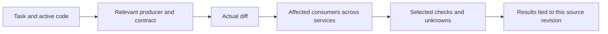

# Making PGraph more useful for developer delivery

Investigation: 2026-09-09. Product source reviewed at commit
`8505dc11f903e15a3d810e5dd5221bb874f26eba`.
This report records the original baseline. See [the v2 delivery tracker](V2_DELIVERY.md)
for subsequent implementation and the remaining release gates.

**Recommendation: make PGraph a task and change assistant that connects intent,
affected code, service consumers and verification.** The existing graph provides
much of the foundation. The largest missing pieces are reliable retrieval from
ordinary language, analysis of the actual diff, and a useful handoff to tests.

The follow-up [smart engine design](SMART_ENGINE_DESIGN.md) specifies how to deliver
these capabilities without AI and what an optional AI-assisted workflow must add.

The assumed initial audience is TypeScript developers using coding agents and
working across services. This follows the existing [v2 plan](V2_PLAN.md), including
its Azure Functions use case. These priorities are engineering recommendations;
developer interviews and completed coding-task trials have not established their
business impact.

## What is already strong

PGraph has compiler-backed TS/JS relationships, persistent SQLite, incremental
invalidation, bounded impact/path queries, source freshness checks, token-budgeted
context, CLI/MCP/Copilot adapters, and a local service/symbol explorer. These are
implemented capabilities, not additions to propose again.

Keep the provider-independent core and the separation between compiler facts,
configuration, heuristics and semantic claims. A model can help find relevant
evidence and describe it; the graph should retain the evidence behind each answer.

The main product opportunity is to make those capabilities accessible during the
developer's task, without requiring them to know symbol names or manually assemble
results from several commands.

## Evidence from this investigation

I typechecked the workspace and ran the engine and workspace test suites: **15 tests
passed**. I also ran a new retrieval probe against a fresh in-memory index of this
repository, with semantic enrichment absent. The probe directory is excluded from
indexing so its own code cannot influence retrieval.

For each of the ten existing self-suite scenarios, the probe retains the same
required-symbol oracle and token budget, but adds one manually written prompt
without the original implementation-symbol hints.

| Probe arm                              | Tasks retrieving every expected symbol | Expected symbol occurrences retrieved | Implementation slices |
| -------------------------------------- | -------------------------------------: | ------------------------------------: | --------------------: |
| Original prompts with identifier hints |                                  10/10 |                                 15/15 |                     0 |
| Natural-language paraphrases           |                                   3/10 |                                  6/15 |                     0 |

For example, “Add a new query tool available to both coding agents and editor
users” did not retrieve the expected `dispatchTool`. The indexing-flow paraphrase
missed all three expected implementation symbols. The budget-selection paraphrase
did find `optimizeBudget`.

This is **diagnostic evidence, not a 60% coding-task failure rate**. The paraphrases
and inherited oracles were not independently validated; some requests permit other
useful answers. There is one paraphrase per task, one repository, and no agent
implementation or acceptance-test trial. Timings have execution-order/cache effects.
Use these cases to diagnose retrieval, then evaluate on held-out tasks.

The [raw report](../benchmarks/reports/natural-language-probe.json) records prompts,
selected/missing symbols, budgets, runtime, commit and source fingerprint. The
[probe script](../benchmarks/probes/natural-language.mjs) reproduces the experiment:

```sh
npm run typecheck
node benchmarks/probes/natural-language.mjs /tmp/pgraph-natural-language-probe.json
```

Run from the repository root with Node >=22.18. This run used Node 22.22.0 on macOS
arm64. The default `node` shim failed in this environment; invoking the installed
Node executable directly worked. The probe uses an in-memory database and normal
index discovery; `PGraph.open` may create `.pgraph`, and configured diagnostic logging
still applies.

## Gaps that affect delivery

| Observed implementation                                                                                                                 | Developer consequence                                                                                          | Evidence                                                                                                                      |
| --------------------------------------------------------------------------------------------------------------------------------------- | -------------------------------------------------------------------------------------------------------------- | ----------------------------------------------------------------------------------------------------------------------------- |
| FTS searches names, paths, signatures and framework labels; ranking mostly uses lexical overlap and proximity                           | A developer who knows the business problem but not its code vocabulary can miss the entry point                | [SQLite search](../packages/graph-store-sqlite/src/index.ts), [ranking](../packages/graph-ranking/src/index.ts), probe above  |
| Context takes three to five leading seeds and expands one hop with a common edge set                                                    | Multi-step feature flows and debugging paths can lose important intermediate code                              | [ContextEngine.context](../packages/graph-context/src/index.ts)                                                               |
| Source representations require a budget of at least 2,500 tokens; the editor command defaults to 2,000                                  | Default context provides orientation but omits implementation bodies even when a small relevant body could fit | [ContextEngine.context](../packages/graph-context/src/index.ts), [context command](../apps/vscode-extension/src/extension.ts) |
| Semantic matches seed candidates, but `rank` is not passed a semantic score; Git co-change is collected but not used by context ranking | Some already-collected evidence does not yet influence ranking as directly as the interfaces suggest           | [context ranking call](../packages/graph-context/src/index.ts), [Git signals](../packages/graph-git/src/index.ts)             |
| The workspace map composes services; context/impact tools still select one root                                                         | Developers and agents must stitch together cross-service changes themselves                                    | [workspace guide](WORKSPACE_GRAPH.md), [extension request dispatch](../apps/vscode-extension/src/extension.ts)                |
| Impact starts from a named symbol; Git integration reads history, not a working-tree change set                                         | “What did my current change affect?” is not a first-class workflow                                             | [GraphQuery.impact](../packages/graph-query/src/index.ts), [graph-git](../packages/graph-git/src/index.ts)                    |
| `testsFor` uses direct relationships and contained symbols; there is no test execution/results workflow                                 | Related test names do not answer which checks to run or what has passed for this patch                         | [GraphQuery.testsFor](../packages/graph-query/src/index.ts), [extension](../apps/vscode-extension/src/extension.ts)           |
| Commands prompt for names and open result documents; the graph explorer has a richer interaction model                                  | Useful information is separated from the active edit and diff                                                  | [extension commands](../apps/vscode-extension/src/extension.ts), [manifest](../apps/vscode-extension/package.json)            |
| Each parse creates a compiler program; editor requests queue behind indexing                                                            | The developer may wait for background work before getting an answer                                            | [TypeScriptAdapter.parse](../packages/graph-typescript/src/index.ts), [EngineClient](../apps/vscode-extension/src/client.ts)  |

The existing [scale report](../benchmarks/reports/RESULTS.md) records approximately
1.9 seconds for context and 7.05 seconds for a leaf update at 10,000 synthetic files.
Those are historical single-run measurements, not freshly measured latency or
performance on the company repository.

## Recommended additions, in priority order

### 1. Retrieve by developer intent and return enough evidence to act

Accept an ordinary request, the active symbol/file, selected diagnostics, and
optionally changed files as explicit task inputs. Editor state should become typed
request data, so CLI and MCP can supply equivalent anchors. Start with existing
FTS; improve candidate generation and selection before adding an embedding service.

Index bounded, source-linked evidence from doc comments, test descriptions, error
messages, route/event names and selected local architecture documents. Give those
sources separate fields and weights. Recognize paths and stack locations directly.
Include configuration constants when relevant; the current context candidate filter
excludes variables/constants regardless of task.

Make expansion depend on the task: incoming consumers for impact, a connected call
path for flow/debugging, tests and assertions for verification. Reserve space for
the target implementation and a relevant test when they fit. Replace the blanket
2,500-token source cutoff with relevance/size-based selection and an explicit
“more evidence needed” response when they do not fit.

Return stable symbol IDs, locations, evidence reasons, freshness and omissions.
Scores should mean ranking priority unless calibrated; they should not be displayed
as probabilities of correctness. Semantic summaries and co-change can contribute
after their benefit is measured. Co-change suggests a companion edit; it does not
prove a dependency. Optional embeddings should be compared against this stronger
local baseline on held-out tasks.

**Delivery benefit:** fewer wrong starting points, repeated searches and follow-up
reads. **Acceptance:** report required-evidence recall and irrelevant-context rate
on multiple paraphrases and held-out repositories; verify complete task outcomes
under the same total context budget. Treat this probe as development data.

### 2. Add “Review My Changes” using the actual diff

Start from working-tree/staged changes or an explicitly selected base/head pair.
Map changed hunks to symbols, then show affected callers, entry points, APIs and
tests with the path explaining each result. Distinguish body edits, signature
changes, added exports, deleted symbols and configuration/dependency changes.

This requires a change-set model and revision-aware analysis. Deleted/renamed
symbols need the old graph or an isolated baseline extraction; the current graph
alone cannot reconstruct removed callers. If baseline evidence is missing, expose
that limitation. Preserve unknown effects for unsupported files instead of treating
them as unaffected. Add deterministic signature/contract checks before proposing
general claims about behavioral compatibility.

[Nx affected](https://nx.dev/docs/features/ci-features/affected) is a useful reference:
it combines changed files with project dependencies to select affected tasks.
PGraph can complement that workflow with symbol-level explanations and, later,
evidenced service consumers. This is a product design inference, not a measured
advantage over Nx.

**Delivery benefit:** catch omitted consumers and tests before review.
**Acceptance:** fixture changes cover additions, removals, renames, public types,
config and multi-file edits; each reported impact has evidence; incomplete analysis
is visible. Measure missed required companion changes on real tasks.

### 3. Turn the service map into cross-service context and impact

Reuse the existing topology composition. Add workspace query APIs and one shared
token budget across roots, using `(rootId, symbolId)` identities and a revision
vector. Traverse from a local change to a communication endpoint, its candidate
consumer, and the consumer's handler/dependencies/tests. Carry provenance and
ambiguity across the whole path.

Current endpoint matching identifies communication candidates; it does not prove
payload compatibility. Add explicit links from producers/consumers to request,
response and message types or schema artifacts. Scope the first compatibility
rules narrowly, such as adding a required field or removing an enum value in a
supported schema. Show unsupported contracts as unknown.

For the Azure use case, prioritize recognizers from actual missed paths: Durable
Functions orchestration, wrappers around HTTP clients, subscription filters and
deployment prefixes. An editable preview of non-secret service/resource mappings
would also reduce topology setup effort.

**Delivery benefit:** developers can follow one change across repository boundaries.
**Acceptance:** a two-service fixture yields both endpoint source locations and
relevant tests; conflicting routes, stale roots, missing mappings and truncation
remain visible. Then validate on the target Functions workspace.

### 4. Connect impact to a verification plan and results

Return selected tests with the reason for each selection, uncovered affected areas,
and relevant typecheck/build/contract checks. Begin with static candidate selection;
add indirect test paths and optional coverage evidence. File coverage cannot be
treated as per-test coverage unless the imported format provides that association.

Use explicit runner adapters or configured VS Code tasks for supported projects.
Test execution belongs in a developer-triggered editor action, separate from
read-only retrieval. The [VS Code Testing API](https://code.visualstudio.com/api/extension-guides/testing)
supports test discovery, run/debug/coverage profiles and results. It does not remove
the need for runner integration, and PGraph should not assume access to another
extension's private test model.

Tie results to a source fingerprint and command/config identity. A later edit makes
the earlier result historical. Keep “candidate test,” “executed,” “passed,” and
“not checked” distinct. When dependency coverage is uncertain, recommend the wider
package suite; targeted tests supplement required CI checks.

**Delivery benefit:** less time choosing checks and diagnosing whether a change is
ready. **Acceptance:** compare selected checks with full-suite outcomes over known
regressions, and report missed failures as well as runtime saved.

### 5. Put a small task panel beside the code

Add cursor/context-menu actions for **Explain This**, **Change Impact**, and
**Relevant Tests**, plus **Review My Changes** in the task panel. Reuse the existing
explorer for expanding evidence. Keep results navigable and linked to their source.

The panel should present the goal, likely edit locations, affected consumers,
verification and unresolved questions. Add a one-action handoff of the reviewed
context to the available coding agent, with manual copy as a fallback. Keep the
existing fine-grained tools and add only task-level operations with demonstrated
value, such as a task context package and a change review result.

Store task context and supplied evidence locally by revision, so follow-up requests
can request new evidence without repeating everything. Store explicit developer
decisions separately from generated suggestions and invalidate source-linked
claims when their evidence changes. Bound retention and offer reset/export.

**Delivery benefit:** fewer command switches and repeated context assembly.
**Acceptance:** observe time and interactions from a fresh task to opening the
correct implementation, and whether developers use the feature again unaided.

### 6. Make readiness and responsiveness dependable

Add a first-use check for Node version/launch, workspace roots, supported files,
configuration and index state. Show what is indexed, excluded, stale, queued or
unsupported, with concrete recovery actions. The current “Indexed” state is too
coarse to express that a repository was only partly understood.

Profile discovery/hashing, compiler setup, extraction, storage and context packing
separately. Then reuse compiler programs, coalesce save-triggered indexing requests,
and cache revision-bound query work. Consider a separate reader for the last
committed snapshot; source snippets still need matching hashes, and a stale answer
must be labeled. Unsaved document overlays are a later improvement requiring
document-version tracking, not just save-event indexing.

**Delivery benefit:** lower waiting time and fewer abandoned first-use sessions.
**Acceptance:** measure query latency including queue time, save-to-ready latency,
peak memory and successful first-use sessions on real small/large workspaces.
Set latency targets after collecting those traces.

## A concrete intended workflow

Illustrative request: “Add a required currency field to the order event.” This is
a proposed interaction, not a result from the current graph.



The developer sees the producer, schema and matching consumers; opens the cited
code; makes the edit with their agent; reviews the changed contract and affected
handlers; runs the suggested checks; and gets an updated result after each edit.
An unresolved external subscriber stays visible throughout. This is where the
graph can shorten delivery work at several steps of the same task.

## Suggested implementation sequence

These are dependency-based milestones, not calendar estimates. Retrieval, diff
analysis and runner integration have different uncertainty; scope the first slice
before assigning dates.

| Milestone                   | Reviewable result                                                                   | Main implementation locations                                             | Exit evidence                                                                      |
| --------------------------- | ----------------------------------------------------------------------------------- | ------------------------------------------------------------------------- | ---------------------------------------------------------------------------------- |
| A: reliable task entry      | Natural-language/context improvements, cursor anchors, readiness, held-out task set | `graph-store-sqlite`, `graph-ranking`, `graph-context`, VS Code extension | Better evidence recall without larger total task context or correctness regression |
| B: one-root change workflow | Diff-to-symbol analysis, affected consumers, suggested tests, task panel            | `graph-git`, `graph-ir`, `graph-query`, `graph-tools`, extension          | Known companion edits detected; user can complete one review/verification flow     |
| C: workspace changes        | Cross-root context/impact, supported contract rules, first runner adapter/results   | Workspace queries, communications extraction, context packing, extension  | A real multi-service change traced and verified with explicit unknowns             |
| D: learning and expansion   | Revision-bound task memory, optional semantic retrieval, additional languages       | Semantic/context storage and language adapters                            | Measured task benefit justifies added cost and maintenance                         |

Before starting a large implementation, collect several recent developer tasks and
observe a few developers using the current extension. Include one unfamiliar-code
task, one bug, one API/event change and one change spanning services. This checks
whether the inferred priorities match actual work.

## Measure delivery, not just context compression

Make **time to a correct, verified change** the principal outcome. Track completion,
acceptance-test success, missed companion edits and rework alongside time. A faster
incorrect change is not a gain. Keep context tokens, exploratory calls, time to
first relevant code, test duration and tool latency as explanatory measures.

Use paired trials with the same repository commit, agent/model, tools and task
acceptance criteria. Randomize run order, count follow-up source reads as well as
the first context response, and include failures/abstentions. For developer trials,
account for learning effects rather than asking someone to repeat the identical
task after learning its answer.

The existing self-suite “test discovery” oracle checks production symbols, not
whether the right tests were retrieved. Extend evaluation to assert relevant tests,
critical implementation evidence and necessary cross-service consumers. The
existing token-saving release gates remain in [ROADMAP.md](../ROADMAP.md); this
investigation does not establish those gates or any developer-productivity percentage.

## Later investments

Importing runtime observations could help distinguish configured interactions from
observed ones, but trace absence is not evidence that a path cannot execute. Start
with explicit trace/coverage artifacts if real tasks need that evidence, and keep
them versioned and separate from static relationships.

For additional languages, evaluate [SCIP](https://github.com/scip-code/scip) ingestion
first. Its protocol provides language-neutral symbol/occurrence data for precise
navigation. PGraph would still need framework, communication, testing and contract
adapters; language navigation support alone does not supply complete impact analysis.

Embeddings, whole-repository model summaries, shared cloud indexes and additional
graph layouts should earn their place through the task evaluations above. The
recommended first investment is reliable task retrieval plus the smallest useful
change-and-verification workflow, built on the graph already present.
