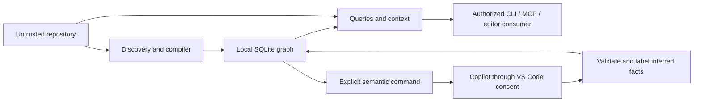

# PGraph threat model

## 1. Overview

PGraph analyzes a developer-selected local repository and supplies compact code
context to authorized coding agents. Let **R** be the selected root after realpath
resolution. CLI and VS Code can build an index; MCP exposes query tools bound to R.
The installed compiler and runtime are trusted tooling. Target source, comments,
configuration, dependency declarations and optional model output are untrusted data.

An independent source-only architecture review was incorporated, followed by local
verification and implementation changes. This document is a threat model, not a
claim of a complete independent security audit or validated exploit findings.

| Component          | Role and source evidence                                                                                                                                                         |
| ------------------ | -------------------------------------------------------------------------------------------------------------------------------------------------------------------------------- |
| Core               | Root/config/store composition: `packages/graph-core/src/index.ts:59`                                                                                                             |
| Discovery/compiler | Hash eligible source; parse JSON compiler settings and source without executing them: `packages/graph-indexer/src/discovery.ts:32`, `packages/graph-typescript/src/index.ts:208` |
| SQLite             | Local graph, schemas 1→2, FTS, provenance, semantic memory, transactions: `packages/graph-store-sqlite/src/index.ts:23`, `packages/graph-store-sqlite/src/index.ts:84`           |
| Queries/context    | Indexed source membership, live hashes, bounded output: `packages/graph-query/src/index.ts:259`, `packages/graph-tools/src/index.ts:191`                                         |
| Editor worker      | Trusted Node process for responsiveness/cancellation; inherited host privileges: `apps/vscode-extension/src/client.ts:27`                                                        |
| Copilot            | Explicit model selection and source-derived evidence transmission: `apps/vscode-extension/src/extension.ts:204`, `apps/vscode-extension/src/extension.ts:253`                    |

| Deployment or workflow    | Resource or capability        | Configuration and precedence                                                | Safe effective value or location                                        | Readers, writers, or recipients                        | Enforcing control                                                                                 | Evidence or unknowns                                                                                                               |
| ------------------------- | ----------------------------- | --------------------------------------------------------------------------- | ----------------------------------------------------------------------- | ------------------------------------------------------ | ------------------------------------------------------------------------------------------------- | ---------------------------------------------------------------------------------------------------------------------------------- |
| CLI/editor indexing       | Persistent graph              | Operator/host root → realpath → fixed child path                            | R/.pgraph/graph.db, graph.db-wal, graph.db-shm                       | Local engine / OS-authorized users                     | Symlink checks; new directory mode 0700; transactions and schema checks                           | `packages/graph-core/src/index.ts:59`, `packages/graph-store-sqlite/src/index.ts:23`; existing directory modes are not reset       |
| CLI/MCP queries           | Read-only graph connection    | Startup root; query-only dispatch                                           | Same database, SQLite readOnly=true                                     | Authorized local client receives selected graph/source | No tool root override, no mutation tools, no schema migrations on read-only opening               | `packages/graph-mcp/src/index.ts:5`, `packages/graph-store-sqlite/src/index.ts:23`                                                 |
| Initialization            | Marker                        | Fixed child path, written only if absent                                    | R/.pgraph/config.json                                                | Local filesystem                                       | Mode 0600, root checks                                                                            | `packages/graph-core/src/index.ts:59`; actual settings are R/.pgraph.json                                                       |
| Discovery                 | Source/manifests              | Hard exclusions, nested .gitignore, custom excludes, source includes        | Eligible paths under R                                                  | Local parser/index                                     | File/count/byte limits, symlink/secret-name exclusions                                            | `packages/graph-indexer/src/discovery.ts:32`, `packages/shared/src/index.ts:86`; not content-level secret redaction                |
| Compiler support          | Config/declaration reads      | Nearest tsconfig/jsconfig and compiler resolution                           | Contained JSON/dependency declarations; installed TypeScript lib.*.d.ts | Local checker and derived signatures                   | Secure local reader; separate 50 MB repository support cap per program; trusted library exception | `packages/graph-typescript/src/index.ts:208`; source includes are not a support-read sandbox                                       |
| Source retrieval          | Indexed live file ranges      | Client symbol or indexed path                                               | R-relative files; selected ranges returned                              | CLI stdout / MCP client / editor model host            | Root, no-follow final open, descriptor identity, size and live-hash checks                        | `packages/shared/src/index.ts:60`, `packages/graph-query/src/index.ts:259`                                                         |
| Optional Git              | Read-only subprocess          | Repo git.enabled=false by default; operator environment                     | PATH-resolved git, -C R, fixed log/rev-parse arguments                  | Local git child; path/commit signals in SQLite         | No shell, fsmonitor disabled, no-ext-diff, 5-second/8 MB limits                                   | `packages/graph-git/src/index.ts:18`; inherited Git config/environment remains trusted host context                                |
| Editor engine             | Separate process              | Trusted local workspace; machine-scoped nodePath                            | Installed dist/worker.cjs, cwd/argument R                               | Worker inherits host filesystem/environment authority  | Workspace Trust; empty execArgv; clears NODE_OPTIONS/NODE_PATH; timeout/cancellation              | `apps/vscode-extension/src/client.ts:27`; not an OS sandbox                                                                        |
| Editor semantic command   | External transmission         | Machine semanticEnabled and explicit user command; VS Code provider consent | Selected symbol skeleton ≤6000 characters, ≤15 relationships, hashes    | Selected Copilot model                                 | Model-token input limit; bounded response; no enrichment tool access                              | `apps/vscode-extension/src/extension.ts:204`, `apps/vscode-extension/src/extension.ts:253`, `packages/graph-core/src/index.ts:138` |
| Library semantic provider | Explicit provider capability  | Repo semantic.enabled plus caller-supplied provider instance                | Compact evidence passed to provider                                     | Provider chosen by library caller                      | No provider instantiated from repo code/config; abort and live-hash checks                        | `packages/graph-core/src/index.ts:172`, `packages/graph-core/src/index.ts:167`                                                     |
| Semantic persistence      | Inferred facts                | Validated JSON response and indexed/live evidence hashes                    | SQLite semantic_cache and dependency rows                               | Local queries, subsequent authorized consumers         | Field/count/confidence validation; separate provenance; dependency invalidation                   | `packages/graph-semantic/src/index.ts:18`, `packages/graph-indexer/src/index.ts:23`                                                |
| Diagnostics               | Local log and run history     | diagnostics=false by default                                                | R/.pgraph/logs/index.jsonl; SQLite last 100 runs                     | Local filesystem readers                               | Root checks; log omits diagnostic contents in favor of count                                      | `packages/graph-indexer/src/index.ts:207`; append log rotation is not implemented                                                  |
| Build/release             | Trusted development execution | Maintainer invokes npm/build/package or workflow                            | Local bundles, npm archives, VSIX; CI artifact upload                   | Maintainers and configured CI                          | Separate from target repository indexing; release workflow does not publish registries            | `scripts/build-extension.mjs:33`                                                                                                   |

## 2. Threat model, boundaries and assumptions

Protected assets are source/embedded secrets, filenames and architecture, graph
integrity, host process authority, editor availability and user control over external
transmission. User-supplied requirements establish local-first behavior and prohibit
executing repository scripts or treating comments as instructions.

A repository contributor can control source, comments, manifests, ignore patterns,
compiler JSON and proposed filesystem layout. This does not imply control of the
operator account, installed runtime, machine settings, Copilot consent or privileged
release infrastructure. A connected MCP client can choose query arguments and make
repeated requests; its legitimate authority already includes exposed code from R.
There is no TCP listener, remote authentication or tenant isolation in this release.

The graph is a regenerable private cache, not an authenticated artifact format.
Do not accept a database supplied by an untrusted repository contributor or team
service without a separate provenance/integrity policy. SQLite and JSON decoding are
native/parser trust boundaries; parameterized queries do not authenticate stored
facts. Corrupt/newer schemas fail visibly. Source paths remain containment-checked
even when obtained from graph records. Evidence: `packages/graph-store-sqlite/src/index.ts:23`, `packages/shared/src/index.ts:60`.

The no-follow/descriptor checks improve resistance to symlink replacement, but this
is not a formal guarantee against an adversary concurrently replacing entire parent
directory trees. Such an attacker requires local filesystem write capability.
Descriptor-relative traversal on every supported OS remains a hardening option.
Windows/Linux release behavior is exercised by configured CI, not claimed from
macOS-only local execution. Evidence: `packages/shared/src/index.ts:35`, `packages/shared/src/index.ts:60`.

Ordinary Copilot tools return context to the invoking model independently of the
semantic-enrichment toggle. Host/client permissions control that use. The toggle
controls the explicit enrichment request, not a guarantee that authorized agents
cannot transmit their tool results. Skeletons may retain literals, type text and
some source syntax; they are neither anonymized nor secret-redacted. Evidence:
`packages/graph-tools/src/index.ts:191`, `packages/graph-typescript/src/index.ts:105`, `apps/vscode-extension/src/extension.ts:204`.

## 3. Attack surface, mitigations and attacker stories

The following are prioritized **hypotheses and residual-risk scenarios**, not
validated vulnerability findings.

| Priority | Scenario and capability gain                                          | Prerequisites                                                                        | Impact                                             | Existing controls                                                                                              | Mitigation / residual work                                                                                  | Evidence                                                                                                                                 |
| -------- | --------------------------------------------------------------------- | ------------------------------------------------------------------------------------ | -------------------------------------------------- | -------------------------------------------------------------------------------------------------------------- | ----------------------------------------------------------------------------------------------------------- | ---------------------------------------------------------------------------------------------------------------------------------------- |
| High     | Malicious layout causes out-of-root source reads or cache writes      | Repo layout control; concurrent replacement needs local write capability             | Source disclosure / host-file damage               | Realpath root, component symlink rejection, no-follow final reads, descriptor identity, fixed cache filenames  | Test platform-specific parent races; consider descriptor-relative traversal                                 | `packages/shared/src/index.ts:35`, `packages/shared/src/index.ts:60`, `packages/graph-core/src/index.ts:59`                              |
| High     | Source comments or accepted model strings redirect a downstream agent | Agent treats untrusted tool text as instructions                                     | Unauthorized agent actions or disclosure           | Explicit untrusted-data prompt, no enrichment tools, separate semantic facts; context labels                   | Host must isolate evidence from instructions; human/task validation of inferred constraints                 | `packages/graph-semantic/src/index.ts:15`, `packages/graph-semantic/src/index.ts:18`, `packages/graph-tools/src/index.ts:191`            |
| High     | Embedded secret is included in authorized model context/enrichment    | Secret lives in indexed source/type text; user enables/request tools                 | Confidentiality loss to selected consumer/provider | Recognized secret filenames excluded; local default; explicit enrichment gate                                  | Exclude sensitive modules; do not claim universal redaction; evidence-preview policy for enterprise rollout | `packages/graph-indexer/src/discovery.ts:32`, `packages/graph-typescript/src/index.ts:105`, `apps/vscode-extension/src/extension.ts:204` |
| Medium   | Oversized or adversarial source/config exhausts CPU/memory            | Malicious repository or repeated local queries                                       | Editor/engine unavailability                       | Discovery and support limits, query depth/count bounds, BPE output cap, process timeout                        | Output budgets do not bound all compiler/tokenizer costs; retain scale tests and narrower scopes            | `packages/shared/src/index.ts:86`, `packages/graph-typescript/src/index.ts:208`, `apps/vscode-extension/src/client.ts:27`                |
| Medium   | Stale or partially updated graph misleads a code change               | Concurrent source edits, interrupted indexing, or unresolved language patterns       | Incorrect code changes                             | Source snapshots, revision check, transactions, affected-file closure, diagnostics, live slices/context checks | Require task tests; ordinary graph/skeleton queries describe last committed index                           | `packages/graph-indexer/src/index.ts:23`, `packages/graph-query/src/index.ts:259`, `packages/graph-store-sqlite/src/index.ts:84`         |
| Medium   | Forged or malformed graph/semantic cache is consumed                  | Attacker can supply accepted cache state; not assumed for normal source contribution | Misleading context, parser/resource failure        | No SQL interpolation of client values, trusted_schema=OFF, version checks, source containment                  | Private caches; provenance policy before any future shared-index ingestion                                  | `packages/graph-store-sqlite/src/index.ts:23`, `packages/shared/src/index.ts:60`                                                         |
| Medium   | Executable/environment resolution runs unintended trusted-tool binary | Compromised machine PATH/config or explicit provider choice                          | Host process authority                             | No shell/repo scripts; machine nodePath; fixed git arguments; default Git disabled                             | Trust installed tools/host configuration; subprocess separation is not privilege isolation                  | `apps/vscode-extension/src/client.ts:27`, `packages/graph-git/src/index.ts:18`, `packages/graph-core/src/index.ts:172`                   |
| Low      | Cleanup/logging races disrupt local graph consumers or grow disk      | Operator cleans while clients remain open, or enables prolonged diagnostics          | Recoverable local index/disk availability          | Cleanup only known graph filenames; transactions; bounded SQLite run history                                   | Stop clients before clean; use rebuild normally; add log rotation                                           | `packages/graph-core/src/index.ts:90`, `packages/graph-indexer/src/index.ts:207`                                                         |

## 4. Severity calibration

**Critical** would require broad host compromise or unauthorized cross-organization
source access from a low-privilege input, with a demonstrated path and deployment.
No remote service or multi-tenant authority is established here, so generic remote
RCE/tenant claims are unsupported.

**High** can apply to a demonstrated repository-controlled path escaping R into
sensitive host data, or bypassing the explicit external-transmission boundary.
An already-compromised operator/runtime is not a new repository-boundary exploit.
An authorized agent reading its configured repository is expected behavior.

**Medium** can apply to realistically reachable parser/resource exhaustion or a
cache-integrity failure that causes consequential agent misuse. Repeated requests
by the same local user and malicious caches require their stated prerequisites.
Prompt-injection scenarios require evidence about the downstream agent's behavior;
model-string validation alone neither proves safety nor proves exploitation.

**Low** covers bounded, recoverable local index disruption, misleading non-sensitive
metadata, or operator cleanup errors without broader privilege gain. Confidence in
an attack path and impact severity are recorded separately. Representative agent
correctness, live Copilot policy checks, platform execution and future shared-cache
provenance remain operational acceptance questions, not silently accepted findings.
