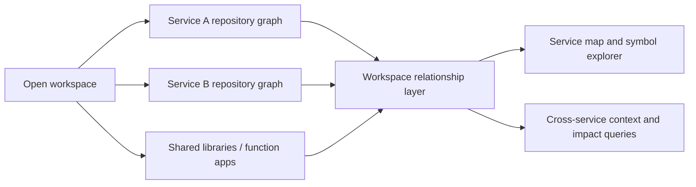

# PGraph v2: explainable repository exploration

Started 2026-09-08. The first delivered change addresses the reported company-repository
indexing timeout. The graph browser and ranking improvements below are planned,
not yet shipped.

## Research and choices

[Graphify](https://github.com/Graphify-Labs/graphify) makes graph exploration concrete
through clickable nodes, search, filters, paths and relationship provenance. Adopt
those interaction ideas using PGraph's own compiler graph. Keep deterministic and
inferred evidence visibly distinct; a drawn edge must have an explanation.

[Cytoscape's layout guidance](https://blog.js.cytoscape.org/2020/05/11/layouts/)
explains the importance of selecting useful subgraphs rather than trying to show
an entire large network. Prefer a bundled Cytoscape.js renderer with a directed
hierarchical layout for call paths and a separate overview layout for packages.
Start with a bounded neighborhood and expand on demand. This is a design choice,
not a performance result for PGraph.

[VS Code's webview guidance](https://code.visualstudio.com/api/extension-guides/webview)
requires deliberate local resource access and content security policy. Bundle all
assets locally, restrict resource roots to the extension, use a nonce-based script
policy, validate messages, and render repository text as text rather than HTML.
The graph view must work without a model account or network request.

[TypeScript's performance guidance](https://github.com/microsoft/TypeScript/wiki/Performance)
discusses project structure and expensive type relationships. Profile actual
compiler workloads before promising an indexing speedup. Excluding dependency
folders from the graph does not eliminate the compiler's need for declaration
files during symbol resolution.

## Delivered: indexing reliability

- Separate execution limits: indexing defaults to 900 seconds, queries to 120.
  Both are configurable in VS Code, bounded to two hours.
- Serialize requests to one worker. A query's execution timer starts when it is
  dispatched, not while it is waiting for indexing.
- Cancel a queued request without stopping the active index. Active cancellation
  and execution timeouts terminate the worker and reject its pending requests.
- Show the current configuration group, elapsed time and timestamped stage output.
- Index all open workspace roots sequentially, keep each root's database, and
  release idle compiler processes between roots. Query tools still select one root.
- Test slow indexing, query queuing, queued cancellation and worker restart with
  real child processes in an isolated extension-host profile.

This prevents premature termination; it does not make the compiler faster or prove
that the company repository will finish within the new limit.

## Workspace and service boundaries

The user's target includes 24 Azure Functions with a mixture of shared/root and
nested TypeScript configurations. Users can also open several independently
versioned microservice repositories in one VS Code workspace. Folder boundaries,
compiler-project boundaries, function-app boundaries and deployed-service boundaries
must not be assumed to be identical.

Index all authorized workspace roots. Keep per-root graphs and source checks, then
add a provider-independent workspace layer over them. Namespace cross-root symbols
with `(rootId, symbolId)` so identical paths and names in two repositories cannot
collide. Record the revision/hash dependencies of every workspace relationship.

The relationship layer and its consumers in this diagram are the intended v2
architecture. Current Index Workspace creates the per-root graphs; it does not
already infer communication between them.

Candidate communication evidence includes HTTP clients and route definitions,
Azure Service Bus queue/topic producers and consumers, Event Grid event contracts,
Durable Functions orchestration calls, and shared database/schema usage. Sharing a
database is a shared-resource relationship, not proof that two services call each
other. Similar identifiers alone never establish an interaction.

Use literal endpoints, trigger/binding metadata, imported APIs and explicit service
mapping to resolve endpoints. Preserve method, normalized route/channel, direction,
source locations, extractor, hash and confidence. Unknown environment-derived URLs
remain unresolved until an explicit mapping is available. Differentiate compiler
facts, configuration-declared links and inferred candidates in both queries and UI.
Do not follow URLs or execute application code to discover topology.

Azure Functions programming models use different registration mechanisms; the
[official Node.js reference](https://learn.microsoft.com/en-us/azure/azure-functions/functions-reference-node)
documents folder/binding-based registration and the newer app registration API.
Add dedicated tested recognizers before claiming Azure runtime-topology coverage.
Keep local secret settings and connection-string values out of discovery evidence.

The explorer should start with service groups and expand toward routes, handlers,
callers and shared code. Impact analysis needs to cross explicitly evidenced service
boundaries while labeling unknown or incomplete downstream relationships.

## Next: an interactive relationship browser

1. Add a provider-independent graph-view query returning nodes, directed edges,
   provenance, source locations, index revision and explicit truncation flags.
   Start with at most 200 nodes and 800 edges; enforce limits before serialization.
2. Add **PGraph: Explore Relationships**. Start at a selected symbol or package,
   then offer incoming/outgoing direction, relationship filters, a depth selector,
   search, fit-to-view, and one-hop expansion.
3. Add a details panel with signature, callers/callees, related tests, confidence,
   and evidence. Open source through a host-validated symbol ID and current file
   location. Provide a keyboard-accessible relationship list alongside the canvas.
4. Preserve selections across refreshes using stable symbol IDs. Show when data is
   stale; never present a truncated neighborhood as the full dependency graph.
5. Test bounded traversal on a large graph, malicious labels/messages, source-path
   confinement, cancellation, and actual webview interaction on supported hosts.

## Then: smarter context and measurable scale

- Add stage timings for discovery, compiler setup, extraction, SQLite writes and
  context ranking, with file counts and peak-memory observations. The current
  stage messages identify the active configuration, but do not distinguish type
  resolution cost from individual extraction hotspots.
- Reuse compiler programs across incremental passes, measure invalidation closure,
  and prioritize affected projects before considering parallel workers.
- Rank exploration by task relevance, dependency distance, public entry points and
  test coverage; explain why each displayed node is included.
- Evaluate tasks without identifier hints, and retain paired correctness checks as
  a release gate. A useful graph picture alone does not prove better agent results.

The existing 10,000-file synthetic reports remain scale evidence for the earlier
implementation, not a substitute for traces from the affected company project.
