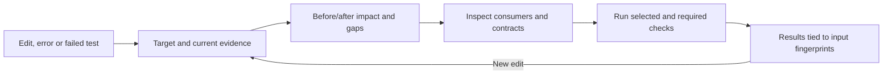

# Where PGraph can gain the most power next

Research follow-up, 2026-09-09, against the uncommitted 0.2.0 preview. This work adds
diagnostics and recommendations; it does not implement the proposed engine features
or change the packaged extension. The [delivery tracker](V2_DELIVERY.md) remains the
release checklist. The audience remains TS/JS developers, especially the Azure
Functions and multiple-service workspace described in [V2_PLAN.md](V2_PLAN.md).

**Prioritize complete evidence for a change: preserve the important implementation,
connect indirect consumers, and show what has actually been verified.** The new
experiments suggest that increasing search breadth or token limits alone will leave
important gaps. No AI is required for those improvements. An AI agent should use
them to make and test better decisions.

## New evidence from the current preview

The [reproducible probe](../benchmarks/probes/retrieval-funnel.mjs) uses one fresh,
in-memory repository index for four request variants. It observes search results,
graph neighbors before representation generation, and final selected symbols.
The [machine-readable report](../benchmarks/reports/v2-research-funnel.json) records
source and engine fingerprints, prompts, locations, representations and results.

| Request variant                                                   | Required symbol occurrences returned | Tasks with full name recall | Required entries represented as source |
| ----------------------------------------------------------------- | -----------------------------------: | --------------------------: | -------------------------------------: |
| Natural language, existing 1,500–2,000 token budgets              |                                 7/15 |                        4/10 |                                      0 |
| Same prompts, 6,000 tokens                                        |                                 9/15 |                        6/10 |                                      4 |
| Same original budgets, cursor anchor to the first expected symbol |                                13/15 |                        9/10 |                                      7 |
| Original identifier-assisted prompts and budgets                  |                                15/15 |                       10/10 |                                      5 |

The anchor arm uses the known answer to establish a target. It is a diagnostic
control, not a fair automatic-search score or evidence of a 13/15 product success
rate. Larger budgets also change internal selection caps. These are the same ten
development prompts and inherited name-based oracles, not independently reviewed
or held-out tasks. No agent edited code, and no application tests were executed.

Four findings matter:

1. **Search already returns five of the eight missing expected symbols.** Examples
   include `PGraph.open`, `SqliteGraphStore.neighbors` and `GraphQuery.fileSlice`.
   A match reaching search does not guarantee it survives filtering, graph expansion,
   ranking and budget selection. The probe does not isolate which later step removes
   each match; that needs explicit selection tracing.
2. **Names found is weaker than implementation supplied.** None of the seven
   required entries in the normal arm uses the `source` representation. Other
   helper/test bodies are present; this does not mean the response contains no code,
   nor does it assess whether equivalent evidence is available elsewhere. Even the
   identifier arm returns only five required entries as source.
3. **Large functions need a better representation.** `GraphIndexer.index`,
   `ContextEngine.context` and `TypeScriptAdapter.parse` span 238, 548 and 662 lines
   in this snapshot. The current source option excludes spans of 180 or more line
   differences. Increasing tokens does not remove that rule. A signature plus a
   few nearby helper bodies may still omit the relevant branch inside the method.
4. **The oracle can reward the wrong outcome.** The identifier-assisted request
   to find tests for `GraphQuery.slice` and `ContextEngine.context` returns both
   names but has an empty selected-tests list. Its name-recall score is perfect.
   A developer task benchmark must require useful test evidence for a test task.

The relevant implementation is in [context selection](../packages/graph-context/src/index.ts),
[lexical ranking](../packages/graph-ranking/src/index.ts) and
[test discovery](../packages/graph-query/src/index.ts). Also, the monorepo prompt
selects seven entries from test files and five from implementation files; the
new-tool prompt selects three example-code entries. Those are observations, not
proof that all tests or examples are irrelevant. They motivate role-aware selection.

## A dependency gap that affects several features

The same probe indexes this small fixture and two tests:

```ts
interface Ledger {
  save(amount: number): number;
}
class SqlLedger implements Ledger {
  save(amount: number) {
    return amount * 2;
  }
}
function throughInterface(ledger: Ledger, amount: number) {
  return ledger.save(amount);
}
function directly(amount: number) {
  return new SqlLedger().save(amount);
}
function injected(amount: number) {
  return throughInterface(new SqlLedger(), amount);
}
```

Observed results:

- `throughInterface` calls `Ledger.save`; `directly` calls `SqlLedger.save`.
- `implementations("Ledger")` returns `SqlLedger`, but
  `implementations("Ledger.save")` returns no members.
- Impact on `SqlLedger.save` reaches the direct-call test but misses the
  injected-call test. Impact on `Ledger.save` reaches the injected-call test.
- Direct `testsFor("SqlLedger.save")` returns neither test because they reach the
  method through intermediate functions.

The compiler has resolved the interface declaration correctly. PGraph lacks the
additional member/receiver relationships needed to join those paths. This is a
reason to strengthen the graph before treating a missing impact path as meaningful.

Proposed implementation: record declared member-implementation relationships;
then model bounded receiver flow through local assignments, construction sites and
simple parameters/returns. Keep declaration membership, possible dispatch targets
and proven-under-supported-flow targets distinct. One indexed implementation does
not prove there is only one runtime implementation. Include structural typing,
overrides, multiple implementations and unknown factories in negative fixtures.

[CodeQL's JavaScript/TypeScript guide](https://codeql.github.com/docs/codeql-language-guides/analyzing-data-flow-in-javascript-and-typescript/)
provides a useful boundary: local flow is cheaper but omits interprocedural effects;
global analysis costs more and may introduce spurious paths. For PGraph, start with
specific receiver and payload flows, with explicit limits, rather than a general
whole-program solver. This is a design recommendation, not a measured improvement.

## Recommended priorities

| Priority | Addition                                         | Developer outcome                                                         | Concrete acceptance condition                                                                             |
| -------- | ------------------------------------------------ | ------------------------------------------------------------------------- | --------------------------------------------------------------------------------------------------------- |
| P0       | Selection tracing and evidence requirements      | Understand why context omitted something; retrieve useful code and tests  | A missing target has an identified stage/reason; test tasks return evidenced tests or a clear gap         |
| P0       | Interface/member links and bounded receiver flow | Follow real dependency-injection paths during debugging and impact review | The fixture above reaches both tests where supported; ambiguous receivers stay explicit                   |
| P0       | Source excerpts inside large methods             | Inspect the relevant branch without opening hundreds of lines             | Excerpts retain source ranges, required local definitions and enclosing conditions; omissions are visible |
| P1       | Before/after change model and change simulation  | Find consumers of removed/renamed declarations; inspect a proposed edit   | Both snapshots and unsupported changes are tracked; supported compiler errors link back to the edit       |
| P1       | Test execution and verification records          | Know which checks passed for the current change                           | Editing source/config invalidates the affected results; cancellation and failures are retained            |
| P1       | Cross-service contract paths                     | Find receiving handlers and payload consumers in other roots              | Both endpoint revisions and a supported contract rule are shown; absent mappings stay unresolved          |
| P2       | Reused compiler state and responsive reads       | Get feedback soon after saving                                            | Measure save-to-ready and queue-inclusive latency on the actual workspace under a memory bound            |
| P2       | Explicit team rules and domain vocabulary        | Surface project-specific obligations without a model                      | Rules cite configuration and evidence; historical patterns remain suggestions                             |

P0 refers to engineering priority for this preview, not a security severity. The
first three items can be developed as small slices. Precise diff work remains a v2
priority, with the dependency probe becoming one of its acceptance fixtures.

## How to make retrieval more useful without AI

Add an opt-in diagnostic path that records search position/field, candidate score,
expansion origin, exclusion reason, representation costs and final selection.
Useful reasons include scope exclusion, unsupported kind, rank cap, insufficient
budget and overlapping ranges. Keep the normal response small; return detailed
traces only when requested. This prevents tuning unrelated stages from one recall
number.

Then compare specific alternatives on a frozen corpus:

- Preserve a candidate's text rank across per-term searches instead of replacing
  it with mostly substring scoring. Current FTS uses English stemming, while later
  lexical overlap uses `includes`; test inflection consistency and weighted rank
  fusion. [SQLite FTS5](https://www.sqlite.org/fts5.html) supplies field weighting
  and ranked retrieval already; replacing the database is not the immediate need.
- Retrieve a few candidates from distinct relevant packages before expanding one
  neighborhood. Apply caps by evidence role and package, with source/test/example
  roles visible. A test may locate production code, but should lead to it through
  an explained path rather than crowd it out.
- Introduce explicit requirements in context selection: an anchor, the relevant
  implementation excerpt, a supported consumer path, and related checks when the
  task needs them. If all cannot fit, return the gap and an expansion handle.
  Avoid a universal percentage quota that forces irrelevant tests into every task.
- Promote enclosing declarations when an internal helper matches; show the parent
  and the relevant excerpt. Preserve both source identity and the reason for the
  parent/child relationship.
- Accept diagnostics, stack frames, failed-test IDs, selected ranges, changed files
  and route/config keys as anchors. Expose actions such as **Explain this error**
  and **What depends on this change?** so no-AI users need not guess vocabulary.

[Aider's repository map](https://aider.chat/docs/repomap.html) also uses dependency
graph ranking and a token budget. The design lesson is that graph context selection
is a useful technique, not proof of task success. PGraph should differentiate
through explained impact and verification, then measure whether those help.

For large methods, begin with AST-aligned excerpts around the selected range,
diagnostic or matched effect. Include referenced local definitions and enclosing
control conditions within a bound. Label them **source excerpts**, not a complete
program slice. Stronger data/control dependence slicing can follow once supported
cases and omissions are tested.

## Analyze the actual change and simulate supported consequences

Build a change record containing baseline commit, staged/working source hashes,
before/after locations, declaration matches and unresolved matches. Index the
baseline with its own configuration; parsing old files using today's aliases or
dependencies can manufacture invalid relationships. If baseline dependencies are
unavailable, preserve syntax-level evidence and report the lost resolution.

Map diff hunks to the smallest owning declarations on both sides, including
zero-length deletion/insertion boundaries. Use Git's rename candidates plus
declaration fingerprints to propose correspondence. Git rename detection uses
content-similarity thresholds, so it is not symbol identity proof.
[Git diff documentation](https://git-scm.com/docs/git-diff)

Compare exported signatures, types and supported contracts, then traverse both
old and new consumers. Add a **Preview consequences** action: apply a proposed
patch to an in-memory or isolated source overlay and collect compiler diagnostics
for supported affected projects. This can reveal known callers that require edits
before the developer changes the working tree. Diagnostics are evidence of specific
issues, not proof that a compiling patch preserves behavior.

Treat tsconfig, package exports, test setup, generated declarations and lockfiles as
first-class change inputs. Current [discovery](../packages/graph-indexer/src/discovery.ts)
does not include lockfiles in its configuration fingerprint. A lockfile change can
alter dependency resolution even when local source text is unchanged. Use a wider
package fallback unless a lockfile adapter establishes a narrower affected set.
[Nx's affected-task design](https://nx.dev/docs/features/ci-features/affected)
combines Git changes with project dependencies and documents conservative versus
resolved-dependency-based handling of lockfile changes; it is a useful reference.

## Verification should become part of the extension workflow

The current review lists candidate tests but runs none. Start with one versioned
runner adapter and typechecking, retaining required package/CI checks. Combine
symbol paths, file-import dependencies and optional observed per-test coverage.
They are different evidence: import reachability does not prove a test executed a
branch, and observed coverage does not guarantee that every relevant test is known.

[Vitest related](https://vitest.dev/guide/cli.html#vitest-related) already supports
file-based related-test selection for statically resolvable imports, with limitations
for computed imports. Reuse supported runner capabilities and record their version;
do not infer runner behavior from the extension's static test recognizer. PGraph's
installed Vitest is 3.2.7, so newer documentation features need version checks before
adoption.

Use [VS Code's Testing API](https://code.visualstudio.com/api/extension-guides/testing)
to expose owned run profiles/results or imported results and coverage. This API
does not by itself provide a general way to commandeer every third-party test
controller; define a runner adapter or a supported integration explicitly.

Every verification record should include the change ID, source/config/lockfile
fingerprints, runner/tool versions, selected checks, exits, results, cancellation
and gaps. A workspace index revision alone is insufficient to identify all inputs.
Mark failed, canceled, not-run and stale separately. A passing subset must never
silently replace required wider checks.

The developer flow can be one small change panel:



This keeps the service graph available for exploration while making daily work
accessible through an action and its result.

## Extend service intelligence with supported contracts

The [workspace layer](../packages/graph-query/src/workspace.ts) already preserves
root identities and revisions. Reuse it to join sender → declared endpoint →
handler → supported payload access → test. Namespace every symbol and retain
each root's source/config fingerprint. A locally indexed version is not necessarily
the deployed version; deployed compatibility needs supplied deployment/version data.

Start with HTTP/OpenAPI and the Azure queue patterns actually in use. Where a repo
has OpenAPI documents, assess a pinned local [oasdiff](https://www.oasdiff.com/docs/breaking-changes)
adapter rather than writing a general compatibility checker. It distinguishes
request and response direction and checks declared contract changes; PGraph would
add source consumers, revision evidence and developer navigation. It would not
establish that the implementation or deployed clients conform to that contract.
TypeScript-only payloads require a smaller explicitly supported rule set.

For Azure, add Durable orchestration/activity links only if that pattern exists in
the target codebase. Microsoft's [orchestrator constraints](https://learn.microsoft.com/en-us/azure/durable-task/common/durable-task-code-constraints)
describe replay-related restrictions; [versioning guidance](https://learn.microsoft.com/en-us/azure/durable-task/durable-functions/durable-functions-versioning)
explains why changes can affect in-flight orchestration history. Candidate local
rules can flag supported changes to activity calls and nondeterministic APIs, while
stating that runtime histories and deployment routing have not been examined.

## Reuse existing engines where they fit

| Capability                            | Recommended approach                                           | Boundary                                                                                       |
| ------------------------------------- | -------------------------------------------------------------- | ---------------------------------------------------------------------------------------------- |
| TS/JS symbol identity and diagnostics | Extend the existing TypeScript compiler integration            | Add supported receiver/contract models; compiler navigation alone is not full runtime dispatch |
| Incremental compilation               | Prototype reused program/builder state per project             | Preserve file-read confinement and configuration invalidation; impose an idle-memory limit     |
| Related-test execution                | Start with a pinned Vitest adapter and explicit package checks | Computed imports and unsupported setups require wider checks                                   |
| OpenAPI compatibility                 | Assess local oasdiff result ingestion                          | Applies to supported specifications; link findings to actual code separately                   |
| Additional language navigation        | Consider SCIP ingestion when there is demand                   | Definitions/references are not complete effect, flow or contract models                        |
| Project rules                         | Reuse structural matchers or the existing TS AST               | Syntax ordering alone does not prove a runtime guard                                           |

The compiler currently caches source ASTs but calls `ts.createProgram` without an
old program. TypeScript documents [watch and builder APIs](https://github.com/microsoft/TypeScript/wiki/Using-the-Compiler-API#writing-an-incremental-program-watcher)
that reuse work for affected files. Prototype under existing bounded filesystem
access rather than adopting an unrestricted default host. Compare warm/cold saves,
config changes, memory growth and worker restarts before choosing the design.

For editor responsiveness, separately evaluate reads against the last committed
snapshot while indexing proceeds. They must visibly identify older evidence and
still reject stale navigation. Measure queue wait plus execution time; the earlier
965 ms synthetic context result measured only that context request's execution.

[SCIP](https://sourcegraph.com/docs/code-navigation/writing-an-indexer) represents
source occurrences, symbol roles and relationships for navigation. It could reduce
the cost of adding language support, while framework contracts and runtime effects
still need additional models. It is not the next dependency to add just to improve
the existing TypeScript workflow.

[ast-grep's relational rules](https://ast-grep.github.io/guide/rule-config/relational-rule)
illustrate composable structural rules. Team rules can cover approved imports,
required registrations and declared boundaries. A check such as “validation text
occurs before send” is not proof that validation dominates every send path; that
requires control-flow analysis. Reviewed rules and glossary mappings should be
versioned. Historical co-change may suggest a companion test, but cannot create a
mandatory project rule by itself.

## What would make the AI experience substantially smarter

Keep the host agent responsible for planning/editing, and give it better query
operations over the same local evidence. These are proposed contracts, not shipped
tool names:

| Operation             | Useful result                                                                              |
| --------------------- | ------------------------------------------------------------------------------------------ |
| `explain_selection`   | Why an anchor/candidate was retained or omitted, and a bounded expansion handle            |
| `trace_dependency`    | A path through members, receivers and supported service contracts, including unknown steps |
| `inspect_change`      | Before/after deltas, affected evidence, required checks and unsupported changes            |
| `expand_evidence`     | Additional requested ranges/contracts for the same snapshot, with prior evidence IDs       |
| `verification_status` | Actual results and freshness for the identified change and execution inputs                |

For each proposed fix, the agent should track the requirement, current hypothesis,
supporting and contradicting evidence, unresolved dependency and next discriminating
check. Prefer a query that can distinguish explanations over repeatedly requesting
the same broad context. After editing, compare the actual patch with the plan and
refresh the affected evidence; do not reuse a pre-edit impact result as verification.

Evidence IDs should identify the root, index generation, symbol/range, source hash
and analysis version. Tool responses need `missingEvidence` and `nextActions`, not
just an uncalibrated confidence number. Claims should cite evidence IDs; a citation
proves where the claim came from, not that the claim follows logically. Source
comments and retrieved text remain data, never instructions to the agent.

An internal model could later propose vocabulary mappings, hypotheses or summaries.
Retain them as inferred candidates, invalidate them on relevant changes, and compare
against the same host agent using the improved local tools. Do not add model calls
per node, embeddings, a second autonomous agent, or a vector database without evidence
that the additional layer improves completed-task outcomes.

## The next experiments that would change the decision

1. Add selection tracing, then compare rank fusion, role requirements and large-method
   excerpts separately on the same frozen index. Reserve new repositories/prompts
   for evaluation. Do not tune weights solely on the ten development prompts.
2. Build positive and negative dispatch fixtures: two implementations, structural
   implementations, overridden members, callbacks, factory returns, wrapper tests
   and unknown dynamic injection. Score expected and spurious paths separately.
3. Test change review on removed/renamed symbols, mixed staged/unstaged edits,
   changed lockfiles, deleted tests, config-only changes and schema incompatibilities.
   Require an explicit gap for every unsupported case; measure explanation accuracy.
4. Run complete tasks on a representative Azure/services workspace: baseline editor
   tools versus PGraph local workflows; then the same coding agent without/with
   PGraph. Compare completion and missed impacts before time, context volume and
   exploratory reads. Count follow-up reads and failed attempts, not just one query.
5. Collect save-to-ready time, queue-inclusive p50/p95, cold start and peak memory
   during realistic editing and indexing. Separate these from caller microbenchmarks.

Start with a small independently reviewed task set covering a bug, an indirect
consumer change, a contract change, a refactor, test discovery and an unsupported
dynamic case. Expand it before making numerical delivery claims. The proposed
priorities remain engineering judgments until those task outcomes are measured.

## Reproduction and status

```sh
npm run typecheck
node benchmarks/probes/retrieval-funnel.mjs /tmp/pgraph-research-funnel.json
```

Run from the repository root with Node >=22.18. This run used Node 22.22.0 on macOS
arm64 and no model calls. The probe excludes its directory from indexing and removes
its temporary fixture. It indexes fixture test declarations but does not execute
those tests. Normal `PGraph.open` initialization may create `.pgraph`; indexing for
this experiment is in memory. No production engine code, dependencies, publishing,
installation or full-v2 completion claim is part of this research follow-up.
